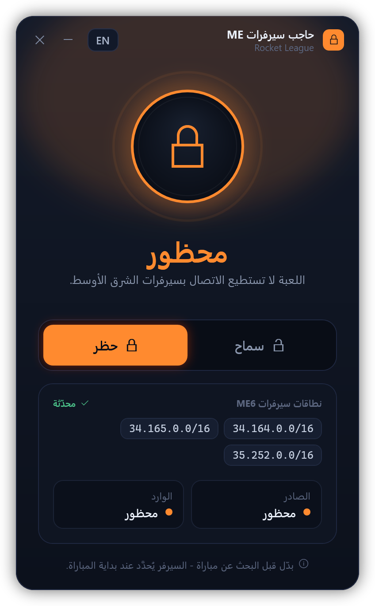

# حاجب سيرفرات ME لـ Rocket League

**[English](README.en.md)**

يمنع Rocket League من وضعك في سيرفرات **الشرق الأوسط (ME6)**. ضغطة للحظر، وضغطة للسماح.

## التثبيت

1. حمّل الملف من [**هنا**](https://github.com/bassam-2023/rl-me-blocker/releases/latest) وفك الضغط عنه (زر أيمن ← Extract All).
2. اضغط مرتين على **`Install.cmd`**.
3. إذا ظهرت رسالة *Windows protected your PC* اضغط **More info** ثم **Run anyway**، ثم **Yes**.

بعد التثبيت يمكنك حذف الملف المحمّل والمجلد.

## الاستخدام

افتح **RL ME Blocker** من سطح المكتب، واضغط **حظر** أو **سماح** **قبل** البحث عن مباراة.

## الإزالة

**الإعدادات ← التطبيقات ← RL ME Blocker ← إلغاء التثبيت.**

## أسئلة

**هل يمكن أن أتبند؟** البرنامج لا يلمس اللعبة إطلاقاً، فقط يضيف قاعدة في جدار حماية ويندوز. الاستخدام على مسؤوليتك.

**يظهر تحذير أن برنامجاً آخر يتحكم في الجدار الناري؟** برنامج الحماية عندك (مثل Norton) يستبدل جدار ويندوز، فالحظر لن يعمل حتى تعيد تشغيل جدار ويندوز.

---

غير تابع لـ Psyonix أو Epic Games. الخط العربي: <a href="https://fonts.google.com/specimen/Tajawal">Tajawal</a> (<a href="src/fonts/OFL.txt">OFL</a>).

