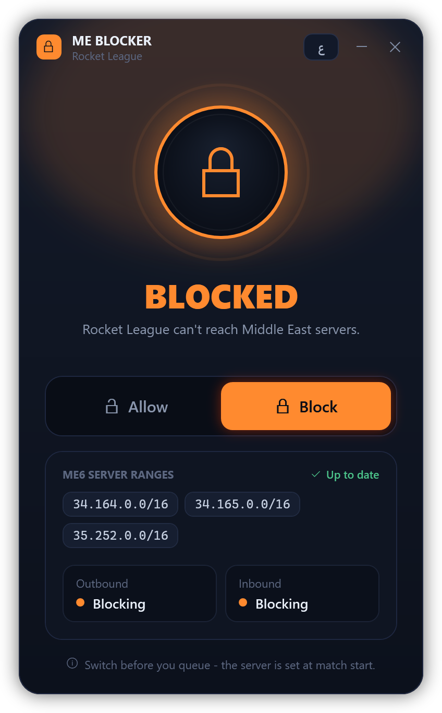

# RL ME Blocker

**[العربية](README.ar.md)**

Stop Rocket League from putting you on **Middle East (ME6)** servers. One click to block, one click to allow.

<p align="center"></p>

It adds two rules to Windows Firewall that block the ME6 server addresses. It doesn't touch the game, its files or its memory. It only decides which servers your PC is allowed to reach.

## Install

1. Download **`RL-ME-Blocker-vX.Y.Z.zip`** from the [latest release](https://github.com/bassam-2023/rl-me-blocker/releases/latest).
2. Right-click the zip → **Extract All**.
3. Open the extracted folder and double-click **`Install.cmd`**.
   - If Windows shows *"Windows protected your PC"*, click **More info → Run anyway**. The warning appears because the tool isn't code-signed. All the code is in this repo if you want to check it.
4. Click **Yes** when Windows asks for permission. Changing firewall rules needs administrator rights.

You'll get an **RL ME Blocker** shortcut on your Desktop and in the Start menu. The app is copied to `%LOCALAPPDATA%\RL-ME-Blocker`, so **you can delete the zip and the extracted folder afterwards**.

<details>
<summary>Prefer one command? (PowerShell)</summary>

```powershell
irm https://raw.githubusercontent.com/bassam-2023/rl-me-blocker/main/src/install.ps1 | iex
```
</details>

## Use

- **Block** stops Rocket League from connecting to ME6 servers.
- **Allow** lets it connect again.
- **Switch before you queue.** The server is chosen when the match starts, so switching mid-match does nothing.
- The Desktop icon changes to show the current state: an orange lock means blocked, a blue open lock means allowed.
- The **ع / EN** button in the title bar switches between Arabic and English.

The block stays on until you switch it off, including after a restart.

## Uninstall

Go to **Settings → Apps**, find **RL ME Blocker**, and click **Uninstall**. If you still have the extracted folder, you can also double-click `Uninstall.cmd` in it.

Either way, the firewall rules, shortcuts and files are all removed.

## FAQ

**Is this a cheat? Can I get banned?**
It doesn't modify, inject into or read anything from Rocket League. It's the same as adding a firewall rule by hand. As with any third-party tool, you use it at your own risk.

**It says another program is managing my firewall.**
Some antivirus suites (Norton, Kaspersky, Bitdefender, etc.) replace Windows Firewall with their own. When that happens, Windows Firewall rules don't apply. Block these ranges in that program's firewall instead, or turn Windows Firewall back on.

**What if the ME6 addresses change?**
The app downloads the current list from [`ranges.json`](ranges.json) in this repo each time it starts. When the list is updated here, everyone's firewall rules update automatically. There's nothing to reinstall.

**Which addresses are blocked?**
`34.164.0.0/16`, `34.165.0.0/16`, `35.252.0.0/16` (the current list is always in [`ranges.json`](ranges.json)). You can see the rules yourself in *Windows Defender Firewall → Advanced settings*. They're named `RL-Block-ME (Inbound)` and `RL-Block-ME (Outbound)`.

## Requirements

Windows 10 or 11. Nothing else to install, since it uses the PowerShell that comes with Windows.

---

Not affiliated with Psyonix or Epic Games. Rocket League is a trademark of Psyonix LLC.
Arabic text uses the [Tajawal](https://fonts.google.com/specimen/Tajawal) font by Boutros International, under the [SIL Open Font License](src/fonts/OFL.txt).
